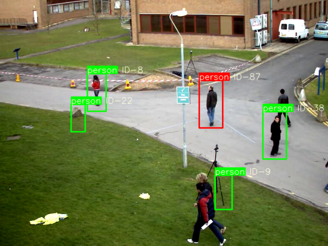

# 综合实验作业（图像处理程序）

我做了两个版本，一个基于深度学习，一个基于传统的机器学习和图像处理

## 一 基于深度学习

### 一 项目简介

**基于YOLO5 DeepSort 的行人多目标属性检测**

使用YOLO5检测每一帧的行人目标位置，

使用多分类网络对每个行人目标属性进行检测，可检测以下信息

上衣颜色，下一颜色，性别，是否带包，是否戴帽子,上下衣简单款式等行人特征

再使用DeepSort(核心是卡尔曼滤波轨迹检测和匈牙利算法匹配目标)进行目标追踪,使用cnn提取特征辅助

可以使用检索系统，指定目标人群的特征

例如(gender:male,hat:yes,up:yellow,down:black)

满足条件的人使用红色框，不满足条件的行人使用绿色框

输入测试的视频文件，最后生成处理好的result.mp4文件

### 二 安装与使用说明

#### 安装

主要使用的库如下

- pytorch
- numpy
- opencv
- PIL

具体所需环境 以及版本 生成 requirements.txt 可以 使用下面两条命令导出和导入

- pip freeze > requirements.txt
- pip install -r requirements.txt

#### 使用

项目目录结构

在demo.py中改变indice_system 中键值对索引的条件

改变输入文件路径，改变输出文件路径即可

输入文件路径：

输出文件路径：

运行demo.py即可使用，可以看到过程，帧率较低

### 三 项目涉及知识点

目标检测算法YOLO5

目标追踪算法 卡尔曼滤波

目标匹配算法  匈牙利算法

属性识别算法  分类神经网络 

属性识别算法backbone ResNet50

### 四 功能展示

摄像头的角度，行人分辨率的大小，物体的遮挡都会影响检索的效果，以及属性分类的threshold值可以在 traker.py中调整

### 五 特色创新

**将目标跟踪，行人属性识别等多个网络结合完成复杂任务**

**使用了交叉分类网络 进行属性简单二分类**

## 二 基于机器学习

### 一 项目简介

**使用行人正负样本HOG特征 训练SVM用于行人目标检测置信度打分**

**对于视频每一帧，转为灰度图提取Harr 特征送入Adaboost级联分类器检测**

**对检测出的框使用 非极大值抑制 算法 NMS 根据置信度和重合度去除大部分重复窗口留下较好的窗口**

**对每个检测出的新人目标 使用Haar特征加Adboost提升算法 进行 头部 上半身 下半身 分块级联识别 打入HSI颜色空间提取出 上衣颜色，下衣颜色，以及后续头部特征提取 口罩 眼镜 帽子等**

**使用 卡尔曼滤波 追踪 目标轨迹**

**使用  匈牙利算法 匹配每帧的检测物体**

**使用 deepSort 辅助检测**

### 二 安装和使用说明

#### 安装

主要的库 numpy opencv PIL sklearn torch

具体所需环境 以及版本 生成 requirements.txt 可以 使用下面两条命令导出和导入

- pip freeze > requirements.txt
- pip install -r requirements.txt

#### 使用

**先安装所需环境，导入项目**

**目录树**

- 先运行 extract_features.py 将 data/images下的行人SVM正负样本 转换为 hog 特征存储到 data/features下 用于训练SVM
- 在运行train_svm.py 用于训练行人检测SVM
- 随后运行demo.py 即可运行项目，看到检测结果
- 
- 可以更改 demo.py indice_system中的检索条件 颜色只划分了基本的 红 绿 蓝 白 黑 是否佩戴眼睛 是否佩戴口罩
- 更改输入视频文件路径
- 更改输出视频文件路径

所有的参数文件都会打包上传 ，配置完环境 可以直接运行 demo.py 查看效果，不需要重新训练SVM,提取Image hog 特征

### 三 项目涉及知识点

图像Hog特征提取

SVM 支持向量机 分类 打分

图像Harr 特征提取

Adaboost 提升算法

CNN

图片 HSV 空间颜色识别

匈牙利算法

卡尔曼滤波算法

### 四 功能展示

视频的角度，每一帧的分辨率都会极大影响检测效果，一些物体也被误检测，一些行人没有被检测，由于SVM训练正负样本数量还是太少，侧边的样本数太少导致行人侧行难以检测出来，可以尝试使用更多姿态的样本进行训练，或者多个SVM联合 Vote

### 五 特色创新

使用传统机器学习算法，将多个检测器联合使用 ，或局部或联合去完成大型任务，过程中发现传统机器学习难以适应多角度的变化，对图片大小分辨率过于敏感，对行人姿态要求较高，在复杂的检测条件下也比较慢

SVM也需要较多样本，较多时间去训练

